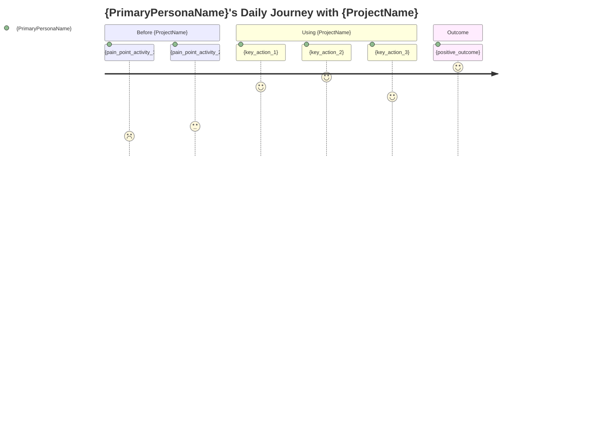
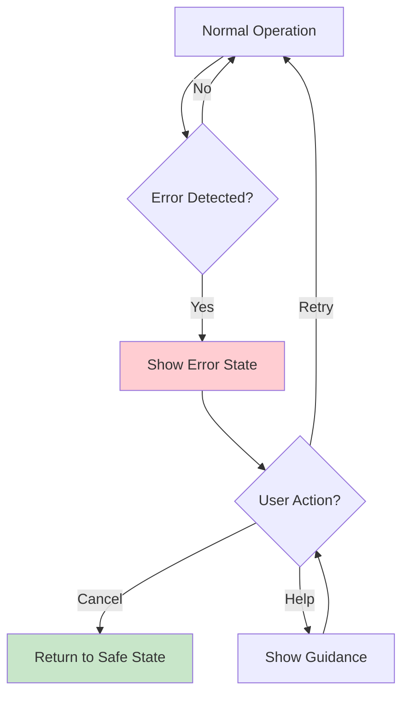
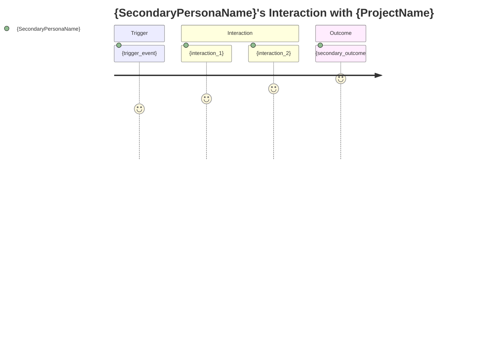
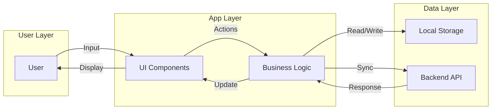
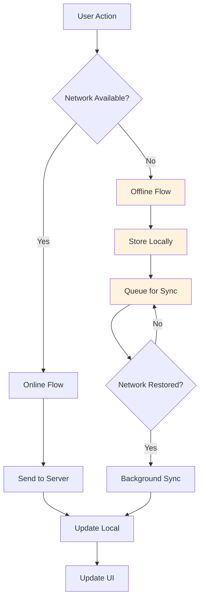

# User Journey Flows: {ProjectName}

Visualizations of primary user journeys extracted during ACIS initialization.

---

## Primary Persona: {PrimaryPersonaName}

### Daily Journey



### Key Flow: {primary_flow_name}

```mermaid
flowchart TD
    A[{start_state}] --> B{Check: {condition}}
    B -->|Yes| C[{action_if_yes}]
    B -->|No| D[{action_if_no}]
    C --> E[{next_step}]
    D --> E
    E --> F[{end_state}]

    style A fill:#e1f5fe
    style F fill:#c8e6c9
```

### Error/Recovery Flow



---

## Secondary Persona: {SecondaryPersonaName}

### Interaction Journey



---

## System State Diagram

```mermaid
stateDiagram-v2
    [*] --> Idle
    Idle --> Active: User opens app
    Active --> Processing: User action
    Processing --> Active: Success
    Processing --> Error: Failure
    Error --> Active: User retry
    Error --> Idle: User exits
    Active --> Idle: User closes app

    state Active {
        [*] --> {default_view}
        {default_view} --> {action_view}: {trigger}
        {action_view} --> {result_view}: Complete
        {result_view} --> {default_view}: Back
    }
```

---

## Data Flow



---

## Offline Journey (if applicable)



---

## Critical Path Identification

| Journey Step | Critical? | Failure Impact | Recovery |
|--------------|-----------|----------------|----------|
| {step_1} | Yes | {impact} | {recovery} |
| {step_2} | No | {impact} | {recovery} |

---

## Journey Metrics

| Metric | Target | Current | Notes |
|--------|--------|---------|-------|
| Time to value (first use) | {target} | - | |
| Steps to complete {key_action} | {target} | - | |
| Error recovery success rate | {target} | - | |

---

*Generated by ACIS /init on {timestamp}*
*Persona data from: {interview | docs}*
